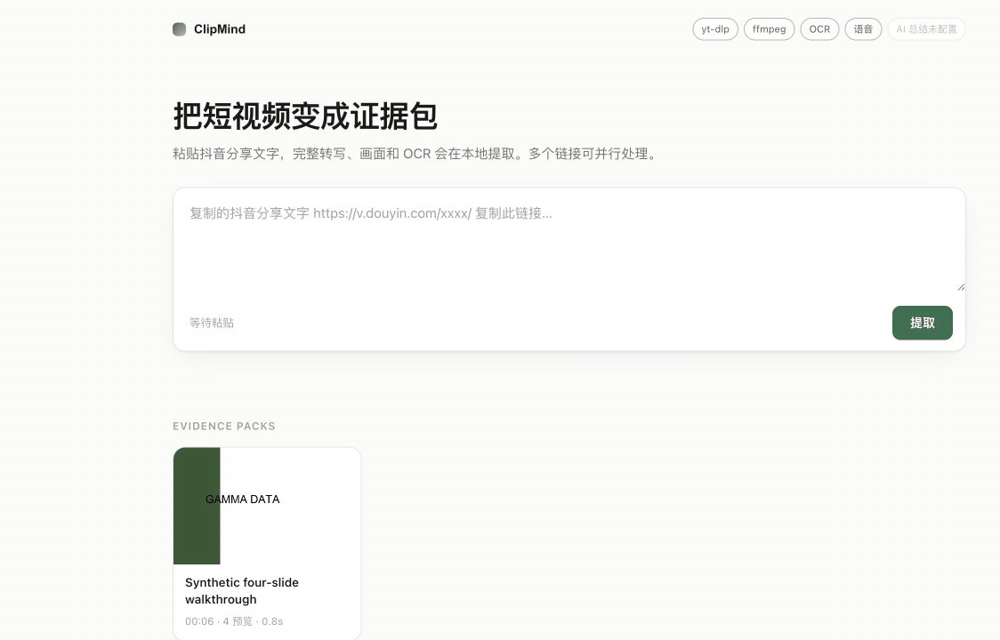

# ClipMind

**Turn videos into evidence that humans and AI agents can actually use.**

ClipMind is a local-first multimodal ingestion engine. Paste a verified YouTube
or Douyin URL, or drop a local file; it extracts timestamped speech, on-screen
text, visual states, layout, scene/build/scroll structure, and provenance into a
versioned Evidence Pack. The result is useful on its own and directly consumable
from a CLI, REST API, Python SDK, or MCP server.

No paid model API is required. ClipMind does not generate a confident-looking
summary from incomplete input: it either publishes a structurally complete pack
or refuses before the expensive stages and shows the estimate.

```text
URL or local file
       │
       ▼
SourceAdapter → temporary MediaAsset ─┬→ local ASR + word timing ──┐
                                      └→ visual states + local OCR ┤
                                                                  ▼
                                              deterministic timeline fusion
                                                                  │
                                                                  ▼
                                                        Evidence Pack v1
                                          ┌───────────────┼───────────────┐
                                          ▼               ▼               ▼
                                      human UI       CLI / REST       MCP / agents
```



The demo uses a synthetic silent four-slide fixture. It contains no downloaded
video, third-party imagery, creator identity, or account information.

## Why ClipMind

Most video tools optimize for a transcript or a generated summary. ClipMind
preserves the source evidence first:

- `visual_states/all/` is the canonical, uncapped evidence set. A comparison
  failure keeps the frame and records a warning instead of silently dropping it.
- `visual_states/preview/` is a smaller derived view for humans. It can collapse
  progressive builds and choose stable representatives without changing the
  canonical set.
- burned-in captions and documents are distinguished using transcript overlap;
  unspoken slide, code, or UI text gets an explicit novelty measurement.
- `manifest.json` is written last. Partial work is never advertised as a
  reusable pack.
- the output is deterministic evidence, not an opinion about what is worth
  saving. A human or downstream agent makes that decision with its own context.

## Verified inputs

| Input | Built-in adapter | Acquisition note |
| --- | --- | --- |
| YouTube / Shorts | `youtube` | yt-dlp; cookies are tried only as configured |
| Douyin | `douyin` | some media requires a current signed-in session |
| MP4, MOV, MKV, WebM, AVI, audio, and other FFmpeg media | `local-file` | copied without modification; shared provenance omits the original directory |
| Third-party packages | `clipmind.sources` entry point | see [Source adapters](docs/SOURCE_ADAPTERS.md) |

Only YouTube, Douyin, and local files are advertised as verified built-ins.
An adapter means ClipMind recognizes and normalizes a source; it is not a
promise that private, removed, region-locked, DRM-protected, or upstream-changed
media can be downloaded.

## Install

ClipMind is not yet published to PyPI and the repository does not claim a signed
public `.dmg`. Install the current development build from a checkout:

```bash
git clone https://github.com/yy31104/clipmind.git
cd clipmind

# macOS
brew install ffmpeg uv

# Linux: install FFmpeg, Tesseract, and uv with your package manager first
./scripts/install.sh .
clipmind doctor
clipmind-app
```

The browser opens at [http://127.0.0.1:8420](http://127.0.0.1:8420). A source
checkout can also run `make run` after creating `.venv` and installing
`clipmind/requirements.txt`.

Windows and Linux use faster-whisper plus Tesseract by default. Apple Silicon
macOS uses MLX Whisper plus Vision. Run `clipmind doctor` before the first job;
model weights may be downloaded by the selected local provider on first use.

For setup details, platform dependencies, Docker, and the unsigned local macOS
build, see [Installation](docs/INSTALL.md).

### Docker

```bash
docker build -t clipmind .
docker run --rm -p 127.0.0.1:8420:8420 -v "$PWD/clipmind-data:/data" clipmind
```

The image uses faster-whisper and Tesseract. It does not bundle browser cookies,
GPU drivers, or model weights.

## Use it

### Web app

Paste one or more links, or drop local media. Inbox shows live jobs, Library
searches complete packs, and the detail view exposes Overview, Visuals,
Transcript, and Evidence. Over-budget work is refused with an estimate; only an
explicit **Process anyway** starts the full untruncated job.

### CLI

```bash
clipmind analyze "https://youtu.be/..."
clipmind analyze --force "/path/to/local-video.mp4"
clipmind list
clipmind search "retrieval augmented generation"
clipmind transcript PACK_ID
clipmind timeline PACK_ID --json
clipmind export PACK_ID --output evidence.zip
clipmind doctor
```

`--force` means “process the complete source despite the estimate.” It never
means truncate, lower resolution, or manufacture a partial pack.

### Python SDK

```python
from clipmind.sdk import ClipMind, PackLibrary

packs = ClipMind().analyze_sync("https://youtu.be/...")
pack = packs[0]
print(pack.id, pack.summary())

hits = PackLibrary().search("vector database")
frame_path, state = pack.frame(timestamp=143.0)
```

### REST API

Start `clipmind serve`, then use the canonical read API:

```text
GET /api/packs
GET /api/packs/{pack_id}
GET /api/packs/{pack_id}/transcript
GET /api/packs/{pack_id}/timeline
GET /api/packs/{pack_id}/ocr
GET /api/packs/{pack_id}/search?q=...
GET /api/packs/{pack_id}/frame?timestamp=143
```

Extraction and browser uploads use `POST /api/jobs` and `POST /api/uploads`.
The local server binds to loopback by default and has no authentication; do not
expose it to a LAN or the public internet.

### MCP for agents

```bash
clipmind-mcp
# or: clipmind mcp
```

The stdio server exposes:

```text
clipmind.extract_video
clipmind.get_transcript
clipmind.get_visual_timeline
clipmind.search_evidence
clipmind.get_frame
clipmind.export_pack
```

It also exposes complete evidence documents as read-only
`clipmind://packs/<pack-id>/evidence` resources. See [MCP integration](docs/MCP.md)
for configuration and tool contracts.

## Evidence Pack

Every successful job publishes `manifest.json` last. The current writer emits
`clipmind-evidence-pack@1.3.0`; readers accept every additive v1 minor from
`1.0.0` through `1.3.0`.

```text
<library>/<pack-id>/
├── manifest.json                 # completion marker, written last
├── source.json                   # normalized provenance
├── job.json                      # durable lifecycle and result view
├── preflight.json                # local estimate; outside the exported contract
├── transcript.jsonl              # segments, optional words/speakers
├── transcript.md
├── ocr.jsonl                     # text plus optional normalized layout boxes
├── visual_timeline.jsonl         # timing, scenes, builds, scrolls, novelty
├── evidence.md                   # deterministic chronological rendering
└── visual_states/
    ├── all/                      # canonical; no count cap
    └── preview/                  # compact derived view; no fixed budget
```

`metadata.json` and `transcript.json` are UI/migration artifacts outside the
canonical ZIP. `note.md` and `keyframes/` are read only for packs created before
the Evidence Pack became canonical; current jobs do not write them.

See [Evidence Pack v1](docs/EVIDENCE_PACK.md) and the machine-readable
[JSON Schema](schemas/evidence-pack-v1.schema.json).

## Local providers

| Capability | macOS Apple Silicon | Linux / Windows | Optional |
| --- | --- | --- | --- |
| ASR | MLX Whisper | faster-whisper | explicit provider/model selection |
| OCR | Apple Vision | Tesseract | normalized layout boxes where available |
| speaker diarization | off | off | local pyannote with extra + `HF_TOKEN` |

Provider failures are explicit modality states. ASR can be unavailable while
visual evidence still completes; per-frame OCR errors retain the image and mark
the record partial. Speaker labels are never invented when diarization is off.

## Extraction invariants

- canonical evidence is never capped, truncated, or silently dropped to meet a
  budget;
- preview derivation cannot remove or repoint canonical artifacts;
- a hash/comparison failure fails open and remains observable;
- `queued` persists before scheduling and `running` persists before acquisition;
- interrupted work is not replayed automatically;
- final media is retained, temporary media is cleaned, and `manifest.json` is
  the only completion marker;
- search uses a rebuildable SQLite index; Evidence Pack files remain the source
  of truth.

These contracts and their failure behavior are detailed in
[Architecture](docs/ARCHITECTURE.md).

## Measured quality

The checked-in extraction-quality corpus measures three public Douyin sources
plus a synthetic silent-slide fixture. YouTube and local-file ingestion have
separate real/synthetic smoke coverage; the corpus is not evidence for any
other source platform.

## Evaluation

```bash
make test            # deterministic offline tests
make eval            # audit existing real-video packs; no re-extraction
make eval-reextract  # fresh real-source extraction; network/providers required
make eval-synthetic  # generated silent-slide end-to-end fixture
make bench
```

- `make test` runs deterministic lifecycle, failure-injection, schema, timeline,
  recovery, cache, concurrency, and visual-algorithm tests without network access.
- `make eval` audits completed real-video packs listed in `eval/cases.json`.
  It is fast and normally offline, but does not prove that the current pipeline
  can reproduce those packs.
- `make eval-reextract` runs the same cases through the current pipeline in a
  fresh temporary library without cache reuse. It requires usable local
  providers, network access, and possibly a current Chrome session; third-party
  source links may expire or disappear. Exact canonical counts are enforced only
  when the downloaded source SHA-256 matches the reviewed case baseline; source
  drift is reported separately and falls back to the broad quality bounds.
- `make bench` checks bounded batch scheduling with deterministic simulated work.

The checked-in three-video evaluation covers long code/UI and scrolling, dense
small text, talking-head captions, inserted documents, and progressive slides:

| Source type | Canonical | Old preview | v1 preview | End-to-end |
| --- | ---: | ---: | ---: | ---: |
| code/UI, 227 s | 243 | 205 | 69 | 41.15 s |
| talking head + documents, 64 s | 29 | 27 | 6 | 13.22 s |
| talking head + slides, 52 s | 31 | 23 | 4 | 8.17 s |

A same-source resolution experiment recognized 1,034 unique OCR characters at
1280 px versus 559 at 640 px; OCR time rose from 24.7 to 36.6 seconds. A 4 fps
probe found production 2 fps covered 105/105 states stable for at least 0.5 s.
See [Real-world evaluation](docs/REAL_WORLD_EVAL.md),
[Benchmarks](docs/BENCHMARK.md), and the checked-in raw JSON measurements.

`make eval-synthetic` generates a silent four-slide fixture and runs the real
FFmpeg, Vision OCR, no-audio degradation, preview, and packaging path. The
recorded run recognized all four labels and retained all four canonical and
preview states.

## Privacy

Speech recognition, OCR, visual analysis, indexing, and pack generation run
locally. URL acquisition and first-use model downloads are network operations.
Browser-cookie access is optional but broad: when enabled, yt-dlp reads the
configured browser cookie store, not only one domain. Evidence Packs can contain
faces, voices, usernames, URLs, and personal information from the source.

Read [Privacy](docs/PRIVACY.md), [Limitations](docs/LIMITATIONS.md), and
[Security policy](SECURITY.md) before exposing or sharing output.

## Contributing

The easiest independent contribution is a source adapter: publish an object
implementing the small protocol under the `clipmind.sources` Python entry-point
group; no core `if/elif` chain is required. Extraction providers and Evidence
Pack readers also have stable boundaries.

Start with [CONTRIBUTING.md](CONTRIBUTING.md), the
[source-adapter guide](docs/SOURCE_ADAPTERS.md), and the
[roadmap](docs/ROADMAP.md). Release history is in the
[changelog](CHANGELOG.md). Please use the issue templates for reproducible bugs
and source requests. Security reports follow [SECURITY.md](SECURITY.md).

Licensed under the [MIT License](LICENSE).
