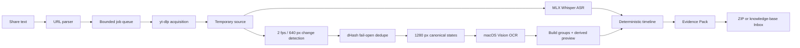

# Architecture

ClipMind is a local-first evidence extractor for Douyin videos. Its canonical
output is a deterministic Evidence Pack, not an AI opinion about what matters.

## Why each stage exists

1. The URL parser accepts the entire share blurb and extracts one or more
   supported links in source order.
2. The persistent job queue writes `queued`, then writes `running` before any
   acquisition side effect. A process crash can therefore distinguish work
   that never began from work that must not be replayed automatically.
3. yt-dlp acquires the original media using Chrome cookies first and an
   unauthenticated request second. The source is temporary.
4. ASR and visual analysis run concurrently because they use different scarce
   resources: Apple GPU and CPU/Vision respectively.
5. Low-resolution frames make change detection cheap. Every deduped index is
   then mapped to a 1280 px frame used for canonical storage and OCR.
6. The timeline joins transcript intervals and visual intervals through stable
   record IDs. It does not need an LLM.
7. `manifest.json` is written last. That single marker distinguishes a complete,
   reusable pack from a partial directory.

## Visual-state semantics

`visual_states/all/` and `visual_states/preview/` have different contracts.

- `all/` is canonical. It has no count or duration cap. dHash compares against
  the last retained frame. If hashing or comparison fails, the frame is retained
  with a safe warning; the following frame is also retained because comparison
  continuity is no longer trustworthy.
- Progressive-build grouping labels adjacent OCR states that monotonically add
  text. It never deletes a canonical file. Replacement or disappearance breaks
  the group.
- `preview/` is derived. It removes intermediate build states, adapts its scene
  threshold to observed visual activity, and chooses one readable representative
  per scene. It has no fixed frame budget.
- A preview can be rebuilt from canonical images and OCR without downloading
  the video again. The maintenance command removes `manifest.json` during its
  atomic swap and publishes it last after timeline, UI metadata, and job cache
  agree.

## Failure behavior

| Failure | Result |
| --- | --- |
| expired/private link or rejected cookies | job ends in `error` with a short action; no raw yt-dlp text in the UI |
| ASR unavailable/fails | visual evidence still completes; transcript is marked `unavailable` |
| OCR fails for some frames | images remain; failed OCR records are explicit and completeness is `partial` |
| dHash fails | frame is retained and marked; evidence fails open |
| optional summary fails | canonical pack remains valid; compatibility note falls back |
| legacy note writer fails | canonical pack remains valid |
| process stops while `running` | restart marks job `interrupted`, cleans temporary files, never auto-replays |
| process stops while `queued` | restart schedules the job exactly once |

## Concurrency and backpressure

The outer job semaphore limits active videos. Separate pools then bound fetch,
ASR, OCR, and optional LLM work. The defaults are four videos, four fetches, one
ASR task, two OCR calls, and four optional LLM calls. Submitting more work does
not create more active processing; overflow jobs remain durably `queued`.

The scheduler benchmark uses eight deterministic simulated jobs and asserts
both peak concurrency and queued overflow. Real ASR and OCR metrics are kept
separate in the real-video evaluation because synthetic scheduler time is not a
claim about media throughput.

## State and identity

- The containing `out/<job-id>/` directory owns job identity. A forged ID inside
  `job.json` cannot redirect later reads or writes.
- Memory is the live cache; every state transition is written through to disk.
- On startup, disk is read once to rebuild the index.
- A repeated normalized URL reuses the newest structurally complete pack. A
  stable Douyin URL can also reuse a pack whose resolved source ID matches.
- Reprocessing is always an explicit new job. Terminal jobs never transition
  back into work.

## Trust boundaries

ClipMind writes only its output directory and an explicitly configured Inbox.
Inbox delivery is one-way and manifest-last. The downstream knowledge-base
agent decides relevance, summaries, deduplication, and long-term retention; it
is not part of this process or schema.
